# Microservices Architecture

## Reference Documentation

This project is a summary to the second part of Dimos Raptis's course on Udemy.

It is based primarily on the references below:

* [Microservices Architecture](https://www.udemy.com/course/microservices-architecture/)


### Features

These are the key features that we'll cover in this project:

- Automated Deployment

- AWS CodeDeploy

- AWS EC2 Launch Configurations

- AWS EC2 Auto Scaling Groups


## Automated Deployment Using AWS CodeDeploy

In this part, we will go a step further and see what are the benefits of automating our deployments and an easy way to achieve that using AWS CodeDeploy.

First of all, let's think about how we deployed our code in the previous demo and why that's not practical in a larger environment.

We will make an assumption that each manual deployment requires around 5 minutes from the operator that executes. This is quite realistic, as we saw in our case. In our previous demo, we had a single server, but real Production environments can have up to 40 servers.

In that case, the same operator would need around three hours to perform the deployment accross all servers.

However, we probably won't have a single microservice. For a small environment of only three microservices, the same operator would need to spend almost a whole day to perform one deployment accross all our environment.

Extrapolating the growth rate of that simplistic model, a realistic environment of 10 microservices would require a whole week of manual work for a single deployment accross all services.

Adopting microservices was supposed to help us work independently and faster but we see that having more services incurs increasing amount of work when deployments are manual.

Automated deployments have many more benefits though.

So let's see each one of them in detail.

- Manual deployments are slow and non-productive

As we've described previously, manual deployments are slow and nonproductive, since developers spend time doing repetitive manual work which could be automated.

- Manual deployments are not repeatable - since they consist of a set of commands that were executed by a person and there is no mechanism to reproduce a specific deployment.

- Manual deployments require extensive documentation - so that people will know what they need to execute.

As always, it is hard to keep documentation updated. On the other hand, automated deployments have documentation baked in the code.

- Manual deployments obstruct collaboration, since usually only a specific group of people know how to perform a deployment and that reduces agility and inovation.

- Automated deployments can help reduce drift in environments - since it is guaranteed that exactly the same code will be deployed in exactly the same way in all environments, such as Development and Production environments.

- Automated deployments pave the way for Continuous Delivery

Now, we'll see how the automated deployment we will implement looks like.

We'll assume that we've already implemented a Continuos Integration workflow. As a result, build artifacts reside in an artifacts store, which is S3 in our case.

We have a fleet of servers where the build artifact needs to be deployed. As we've mentioned previously, we will use an AWS service called CodeDeploy, which will be responsible for retrieving the build artifact and deploying it to the servers.

To be more accurate, this is implemented via an agent that's running in the servers in the background and when requested, performs a deployment. That means it fetches the artifact locally in the server and deploys it.

Let's have a more detailed look at how this is implemented.

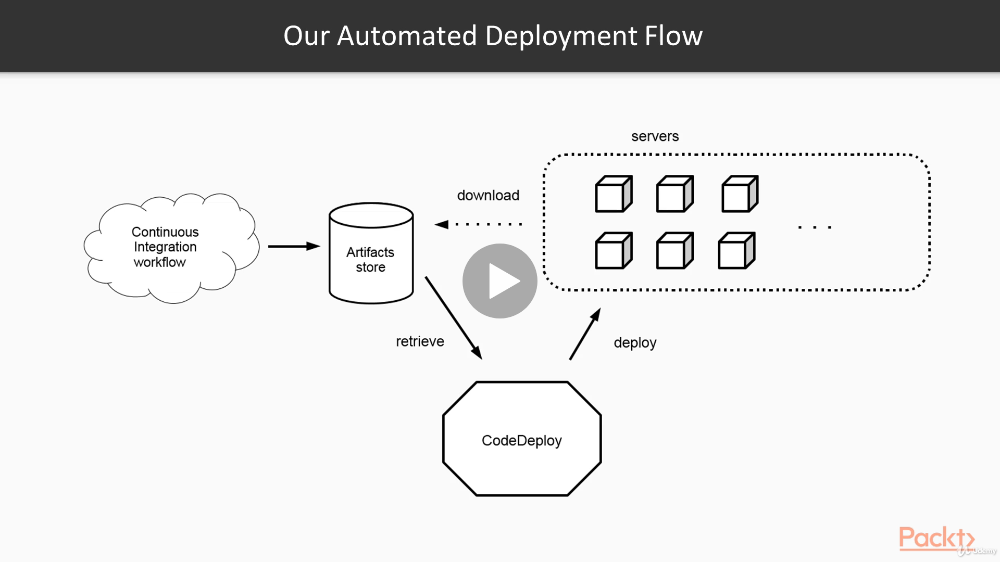

Automated Deployment Flow, by Dimos Raptis, [Udemy](https://www.udemy.com/course/microservices-architecture/).

As we have seen in the previous demo, we've already set up a Continuous Integration workflow, which creates an artifact and stores it in S3.

We've run that already and we can see the artifact here.

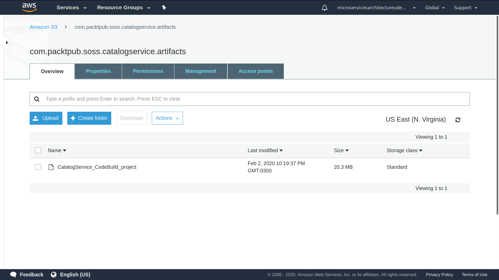

We'll now see how we automate the deployment process.

Before proceeding, we'll need to update the CodeBuild project from the previous demo, so that artifacts packaging is set to Zip.

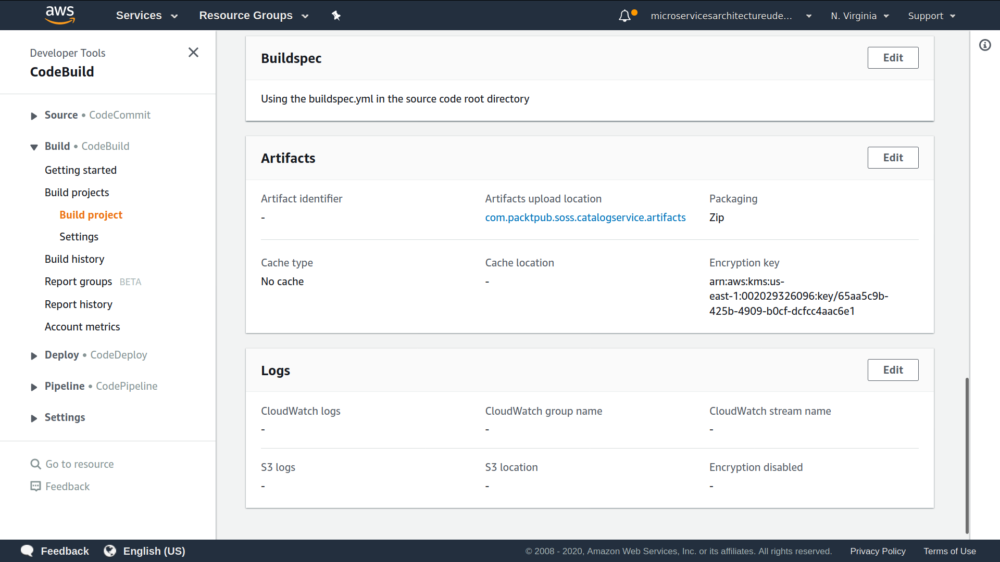

Then, we create a Launch Configuration for launching new EC2 instances. This Launch Configuration will use the settings we used previously, e.g., the corresponding security group, IAM role, AMI and will have CodeDeploy agent installed. 

```
aws autoscaling create-launch-configuration --launch-configuration-name catalog-service-config --key-name EC2_instance_key --image-id ami-0a15709e42caa7e47 --instance-type t2.micro --iam-instance-profile EC2-AppServer-Instance-Profile --security-groups app-server-sg --user-data file://aws/ec2_user_data.sh
```

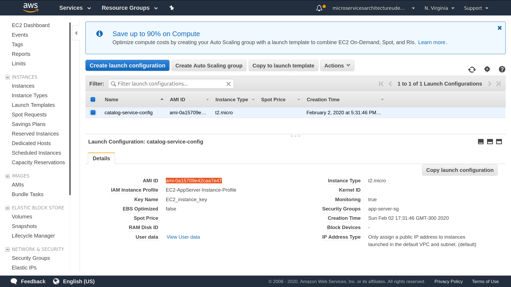


We'll also create an Auto Scaling Group, which uses that Launch Configuration, as we can see below.

```
aws autoscaling create-auto-scaling-group --auto-scaling-group-name catalog-service-scaling-group --launch-configuration-name catalog-service-config --min-size 0 --max-size 3 --availability-zones us-east-1d
```

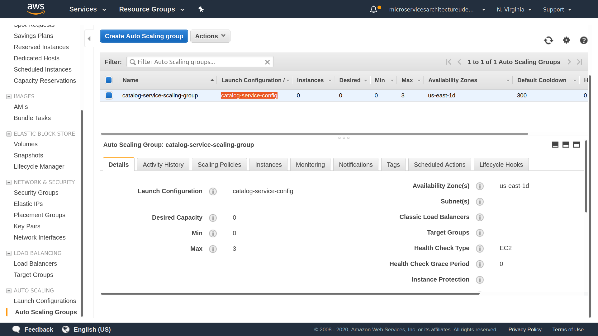

For now, it has no Scaling Policies. We will update its capacity manually, as we will see later on.

Now, we'll update the IAM role (for EC2) with permissions for artifacts on S3. The file ec2_app_server_policy.json now also contains additional permissions for the S3 bucket, so that EC2 servers can download the artifacts.

So, we'll execute the following (after replacing the region & aws_account_id) to update the policy:

```
aws iam put-role-policy --role-name EC2-AppServer-Role --policy-name EC2-AppServer-Permissions --policy-document file://aws/ec2_app_server_policy.json
```

Let's create an IAM Role for CodeDeploy as well.

```
aws iam create-role --role-name CodeDeployServiceRole --assume-role-policy-document file://aws/code_deploy_trust_policy.json
```

Let's attach the AWS-managed policy for CodeDeploy to the newly created role:

```
aws iam attach-role-policy --role-name CodeDeployServiceRole --policy-arn arn:aws:iam::aws:policy/service-role/AWSCodeDeployRole
```

And then, let's create a CodeDeploy Application for our CatalogService.

```
aws deploy create-application --application-name CatalogServiceApp
```

Now, we'll create the a Deployment Group for the Application.

```
aws deploy create-deployment-group \
--application-name CatalogServiceApp \
--auto-scaling-groups catalog-service-scaling-group \
--deployment-group-name CatalogServiceDG \
--deployment-config-name CodeDeployDefault.OneAtATime \
--service-role-arn <service-role-arn>
```

And let's create a Deployment for the Deployment Group.

```
aws deploy create-deployment \
  --application-name CatalogServiceApp \
  --deployment-config-name CodeDeployDefault.OneAtATime \
  --deployment-group-name CatalogServiceDG \
  --s3-location bucket=com.packtpub.soss.catalogservice.artifacts,bundleType=zip,key=CatalogService_CodeBuild_project
```

We can see that we've set up this Application so that it deploys to the Auto Scaling group we've seen previously:

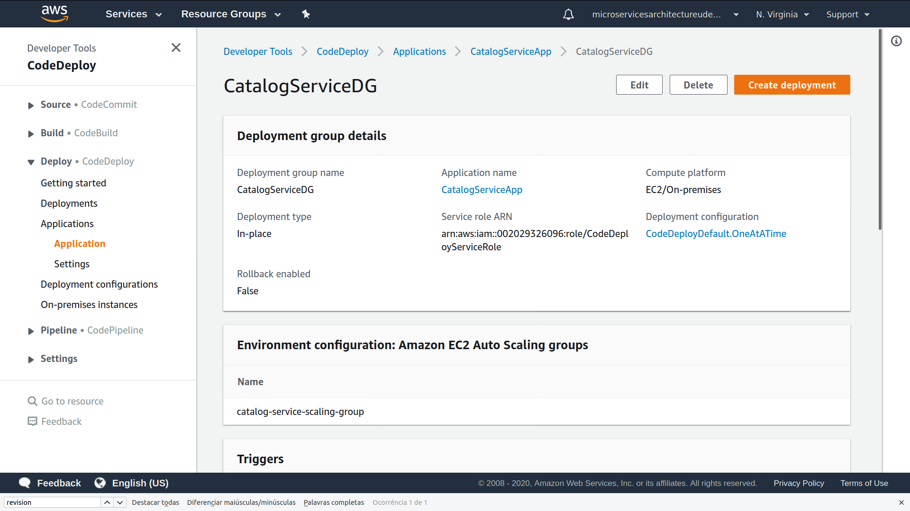

And that there is one Revision where the artifact that we saw previously in the S3 bucket is configured there.

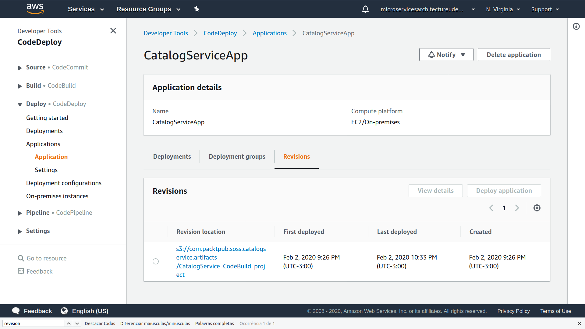

What this means is that we can manually trigger a deployment and CodeDeploy will download all the files of our artifact in any existing server in this Auto Scaling group and start the application.

What's even more convinient is that when new servers are provisioned, CodeDeploy will perform a deployment automatically for us.

To see how that happens, we are going to start a new server.

First, let's check that our Auto Scaling group is empty.

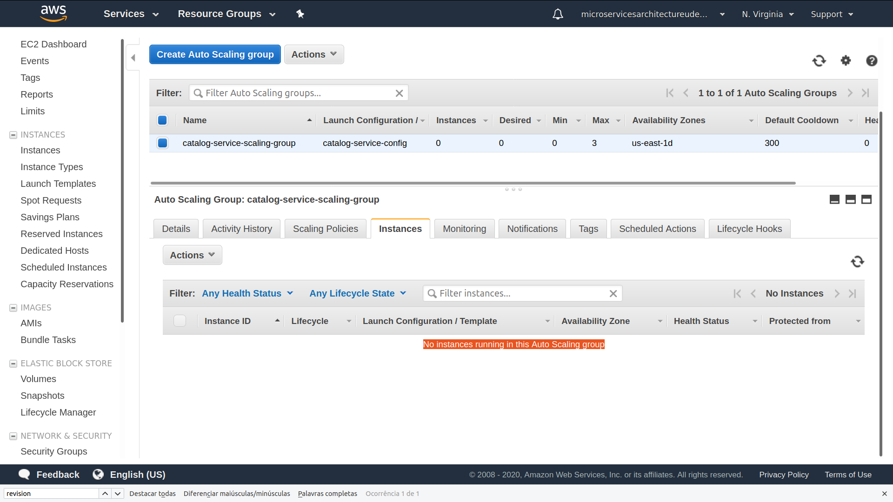

We see here that there are zero instances and we can also check the Tab where we see no servers running.

Now, let's update the desired capacity of the Auto Scaling group to 1:

```
aws autoscaling update-auto-scaling-group --auto-scaling-group-name catalog-service-scaling-group --desired-capacity 1
```

If we go back and refresh our page, we will see now de Desired capacity is 1 and if we wait a while, we will probably see in a while that the Auto Scaling group will start provisioning a new server.

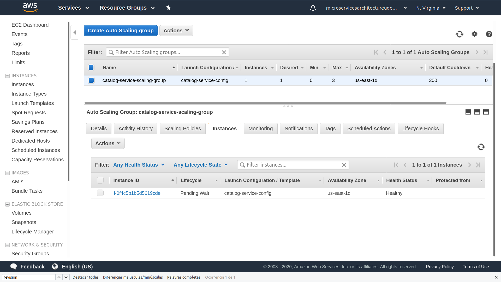

So, it will take a while for that server to be provisioned, so let's give it some time.

We see that the server is now running.

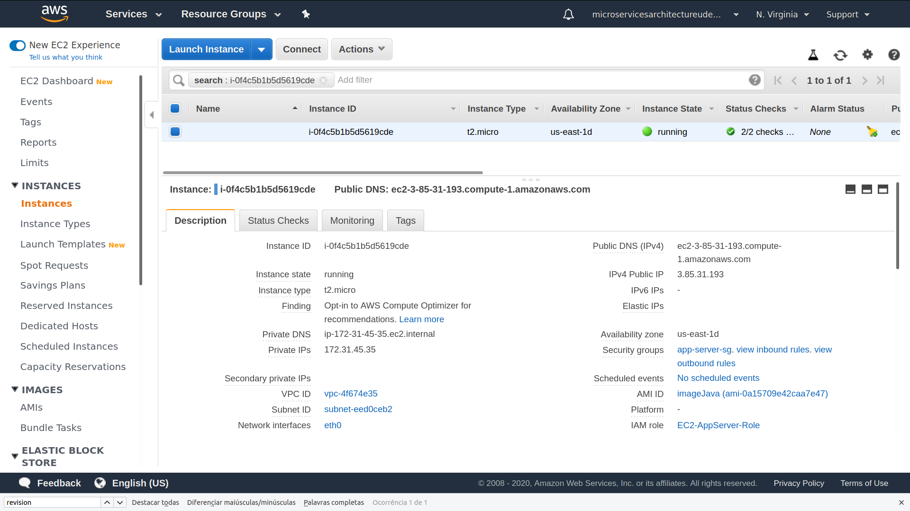

So, if we go back to CodeDeploy, and select our CodeDeploy Application, we will see that the Deployment succeeded.

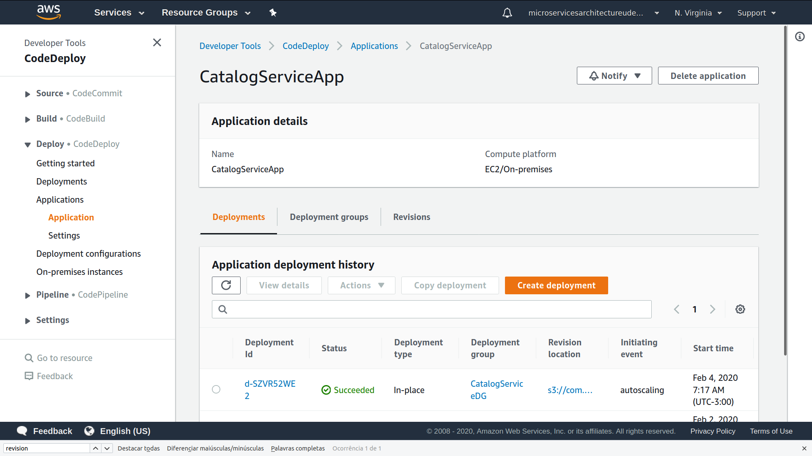

When we click on that, we will see the various stages that were executed.

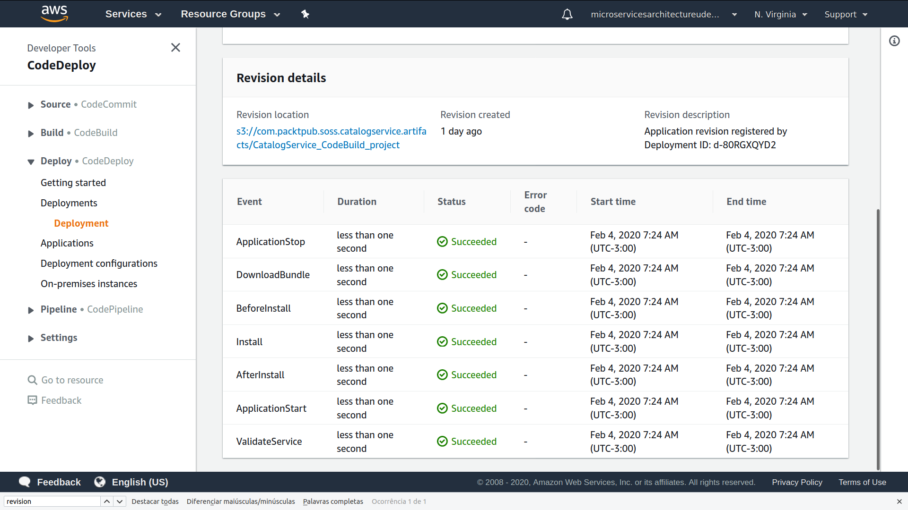

Let's see some parts of the implementation.

We'll notice that was added a file called appspec.yml in the root directory.

```
version: 0.0
os: linux
files:
  - source: /
    destination: /home/ec2-user/catalog-service
hooks:
  ApplicationStart:
    - location: start_server.sh
      timeout: 300
      runas: ec2-user
  ApplicationStop:
    - location: stop_server.sh
      timeout: 300
      runas: ec2-user
permissions:
  - object: /home/ec2-user
    pattern: "catalog-service"
    owner: ec2-user
    mode: 700
    type:
      - directory
  - object: /home/ec2-user/catalog-service
    pattern: "*.sh"
    owner: ec2-user
    mode: 777
    type:
      - file
```

This is a configuration file which instructs CodeDeploy on the various steps of the Deployment.

We can see here, for example, that in the ApplicationStop statement, the stop_server.sh will run, while in the ApplicationStart statement, the start_server.sh script will run.

The script for starting the server is extremely simple.

```
#!/bin/bash
cd /home/ec2-user/catalog-service
java -jar CatalogService.jar -Dspring.profiles.active=prod > /dev/null 2>&1 &
```

It navigates to the directory where the application is deployed and then it starts the application server with the command we've seen previously.

On the other hand, the stop_server script is also quite simple as well. We can see that it kills a process that has a name that contains `java` and `CatalogService` in it.

This is needed because CodeDeply needs to stop any existing applications before deploying a new one.

So, let's connect to our server now.

We can see that there is a new folder called `catalog-service` that contais all the files of the artifact.

And we can also see that the server is already running.

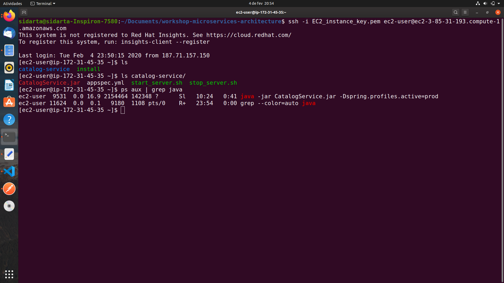

